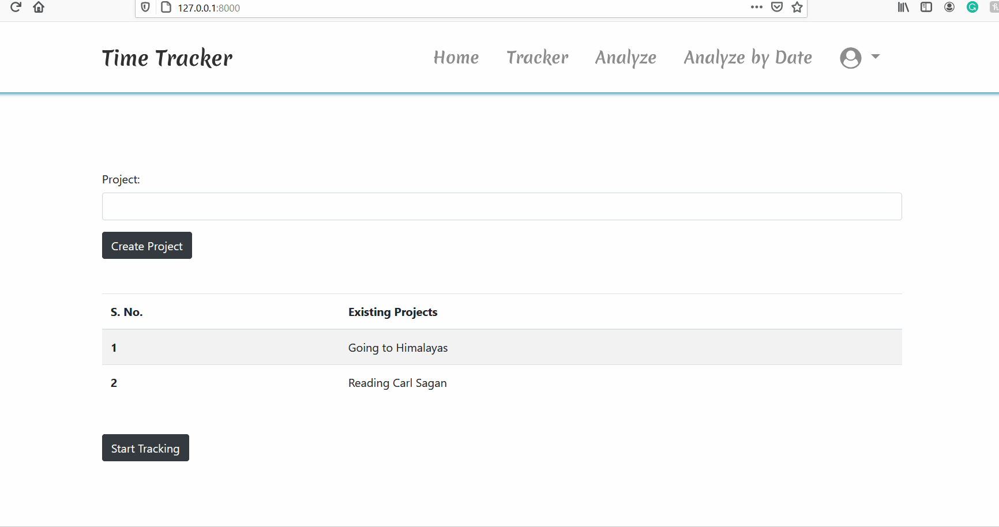

# An Time-Tracker app made with Django ❤️

### Demo: https://dj-timelapse.herokuapp.com/ 
***Technologies Used:***

    Django
    Javascript
    Jquery
    Bootstrap

***Installing:***

    Clone this Repo.
    Unzip
    Make a virtualenv
    Start virtualenv
    pip install -r requirements.txt
    python manage.py makemigrations
    python manage.py migrate
    python manage.py createsuperuser
    Make sure the ecom_core > settings > base.py has development setting imported
    open the development server at port 127.0.0.1:8000

